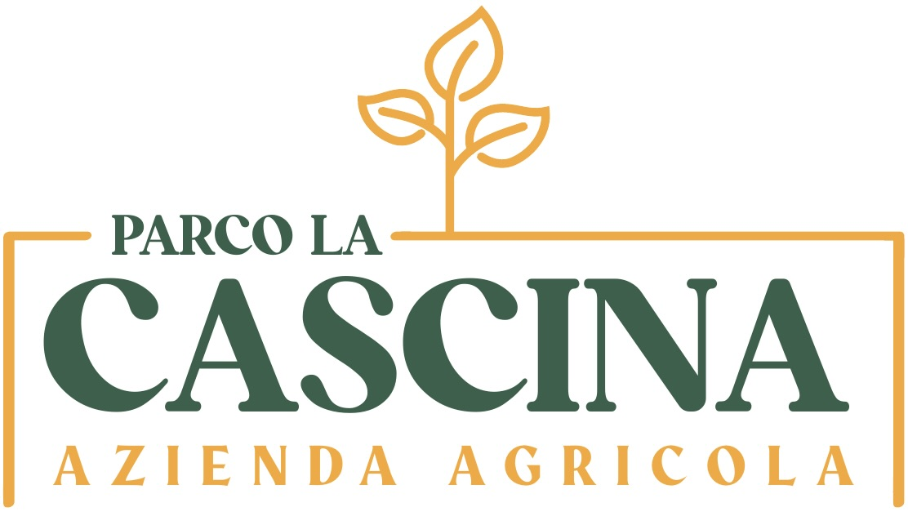
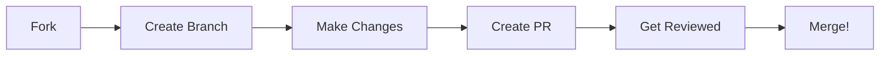

<div align="center">
  

  # 🌿 Parco La Cascina Website

  [](https://reactjs.org/)
  [](https://tailwindcss.com/)
  [](LICENSE)
  [](http://makeapullrequest.com)

  <p align="center">
    A modern React.js website showcasing fresh agricultural products from our botanical park 🌱
    <br />
    <a href="https://parcolacascina.vercel.app"><strong>Visit Website »</strong></a>
    <br />
    <br />
    <a href="#demo">View Demo</a>
    ·
    <a href="https://github.com/nannipy/parcolacascina/issues">Report Bug</a>
    ·
    <a href="https://github.com/nannipy/parcolacascina/issues">Request Feature</a>
  </p>
</div>

---

## ✨ Features

<details>
<summary>Click to expand features</summary>

🎨 **Modern UI/UX**
- Responsive design for all devices
- Smooth animations and transitions
- Interactive image carousel

🛒 **E-commerce Features**
- Product showcase
- Online ordering system
- Email integration for order processing

📱 **User Experience**
- Fast loading times
- Intuitive navigation
- Contact form integration

</details>

## 🚀 Tech Stack

<details>
<summary>Click to expand tech stack</summary>

| Technology | Purpose |
|------------|---------|
| [React.js](https://reactjs.org/) | Frontend framework |
| [Tailwind CSS](https://tailwindcss.com/) | Styling |
| [React Router](https://reactrouter.com/) | Navigation |
| [EmailJS](https://www.emailjs.com/) | Email service |
| [Framer Motion](https://www.framer.com/motion/) | Animations |
| [React Icons](https://react-icons.github.io/react-icons/) | Icons |
| [Vercel Analytics](https://vercel.com/analytics) | Analytics |

</details>

## 🏗️ Quick Start

<details>
<summary>Click to see setup instructions</summary>

### Prerequisites

```bash
node -v  # Must be ≥ 14.0.0
npm -v   # Must be ≥ 6.0.0
```

### Installation

1️⃣ Clone the repository
```bash
git clone https://github.com/nannipy/parcolacascina.git
```

2️⃣ Install dependencies
```bash
cd parcolacascina
npm install
```

3️⃣ Set up environment variables
```bash
cp .env.example .env
# Edit .env with your EmailJS credentials
```

4️⃣ Start development server
```bash
npm start
```

</details>

## 🤝 Contributing

<details>
<summary>Click to see how to contribute</summary>

We love contributions! Here's how you can help:



Check our [Contributing Guidelines](CONTRIBUTING.md) for more details.

</details>

## 🎯 Roadmap

<details>
<summary>Click to see our future plans</summary>

- [ ] Product inventory management
- [ ] User authentication
- [ ] Multi-language support
- [ ] Shopping cart functionality
- [ ] Product categories
- [ ] Enhanced SEO
- [ ] Automated testing
- [ ] Mobile app version

</details>

## 📞 Connect With Us

<div align="center">

[](https://instagram.com/parcolacascina)
[](mailto:parcolacascina@gmail.com)
[](https://parcolacascina.vercel.app)

</div>

## 💖 Support Us

If you find this project helpful, please consider:
- Giving it a ⭐️ on GitHub
- Sharing it with friends
- Following us on social media

## 📄 License

This project is licensed under the MIT License - see the [LICENSE](LICENSE) file for details.

---

<div align="center">
  Made with 💚 by the Parco La Cascina Team
</div>
